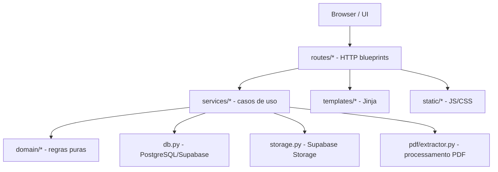

# Arquitetura

## Objetivo da refatoracao

O projeto saiu de um `app.py` monolitico para uma estrutura com responsabilidades separadas. A meta foi reduzir acoplamento, aumentar coesao e manter funcoes pequenas, favorecendo complexidade cognitiva baixa.

## Camadas

## Responsabilidades

### Entrada da aplicacao

- `app.py`
  - Cria a aplicacao com `create_app()`.
  - Mantem compatibilidade com `from app import app`.
  - Inicia o servidor quando executado diretamente.

### Factory

- `studypdf/app_factory.py`
  - Configura Flask.
  - Registra lifecycle de banco.
  - Registra blueprints.
  - Registra filtros Jinja.
  - Registra handlers de erro.
  - Inicia worker de processamento.

### Infraestrutura

- `studypdf/db.py`
  - Abre e fecha conexao PostgreSQL/Supabase.
  - Inicializa schema.
  - Converte linhas para dict.

- `studypdf/storage.py`
  - Envia, baixa, lista e remove arquivos no Supabase Storage.
  - Mantem PDFs originais e assets extraidos fora do filesystem local.

- `studypdf/config.py`
  - Caminhos base.
  - Status de livros e jobs.
  - Tipos de nota.
  - Limites de extracao de imagem.

### Dominio

- `studypdf/domain/reader.py`
  - Calcula progresso geral e por capitulo.
  - Gera numerais romanos.
  - Detecta titulos de capitulos reais.
  - Monta modelo de navegacao do sumario.

- `studypdf/domain/notes.py`
  - Normaliza dados de formulario de nota.
  - Define ordem dos tipos de nota.
  - Extrai contexto ao redor de um trecho selecionado.

- `studypdf/domain/text.py`
  - Utilitarios puros de texto e tags.

### Processamento PDF

- `studypdf/pdf/extractor.py`
  - Extrai paginas, texto e imagens com PyMuPDF.
  - Converte blocos de texto em HTML semantico.
  - Detecta capitulos a partir do TOC do PDF.
  - Salva imagens extraidas em diretorio temporario para upload no Supabase Storage.

### Servicos

- `studypdf/services/books.py`
  - Recupera livro.
  - Lista estante.
  - Remove livro e arquivos.
  - Busca paginas/capitulos.

- `studypdf/services/notes.py`
  - Cria, edita e remove notas.
  - Valida campos.
  - Resolve pagina vinculada.

- `studypdf/services/processing.py`
  - Processa livros.
  - Regrava paginas/capitulos.
  - Atualiza jobs e status.
  - Executa worker em background.

### Rotas por feature

- `studypdf/routes/main.py`
  - Home.
  - Tela de busca.

- `studypdf/routes/books.py`
  - Estante.
  - Upload.
  - Leitor.
  - Progresso.
  - SSE.
  - Reprocessamento.
  - Exportacao HTML/PDF/assets.

- `studypdf/routes/notes.py`
  - CRUD de notas.
  - Destaques.
  - Busca API.
  - Exportacao Markdown para IA.

## Regras de dependencia

- Rotas podem depender de servicos, dominio e infraestrutura.
- Servicos podem depender de dominio e infraestrutura.
- Dominio nao deve depender de Flask, banco de dados, filesystem ou request.
- Extracao PDF nao deve depender de Flask.
- Templates e JS nao devem conter regra de negocio persistente.
